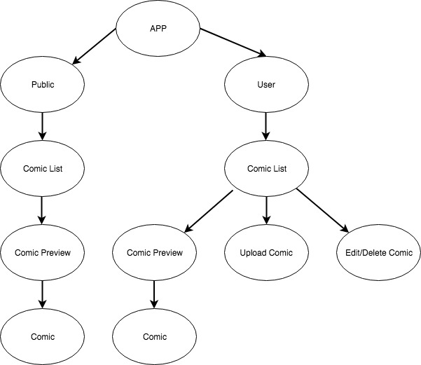

# PROJECT PLANNING
## Overview
The general idea is that users can use this app as a means of uploading, storing, and viewing their comic books. Simple, right? Seemingly. Though the MVP seems pretty to the point and achievable, the more complex things lay in the stretch goals in trying to provide users with new and interesting ways to read and interact with their comic books.

## Primary Technologies
* **React:** React.js will handle the front end viewing and UI/UX as well as provide client-side routing for higher performance as images and come and go from view.
* **PostgreSQL:** SQL-based database that will store user information and comic books.
* **Ruby:**  Any extensive back end logic will be handled by Ruby. Also may be used to create an API to communicate between the database and the front end.
### Potential Technologies
* **React360:** Potential UI/UX stretch goal library that will allow the pages to be rendered on a semi-panoramic surface.
* **Firebase:** Realtime database and potential alternative to PostgreSQL.
* **A-Frame:** HTML-based VR/3D object rendering library.

## Component Tree

### Component Breakdown
* **App:** Single common parent/ancestor for the entire application. Will hold state or Redux store and handle routing.
* **Public:** Contains all public-facing comics and data for viewing and use without user login or specific user privileges.
* **User:** Contains all user-oriented comics and data for viewing only by specified user.
* **Comic List:** Contains all data/comics for reading
* **Comic Preview:** A card previewing the comic's cover and relevant information (name, issue, etc.)
* **Comic:** The rendered images/pages of the comic for viewing.

## Resources
* **Chart Making:** https://www.draw.io/
* **A-Frame:** https://aframe.io/
* **React 360:** https://medium.com/better-programming/exploring-react-360-vr-library-7260d51dc776
* **React/PostgreSQL Tutorial:** https://www.youtube.com/watch?v=2oAS7MtMwqA
* **Comic Book Archive file type (.cbr, .cbz):** https://en.wikipedia.org/wiki/Comic_book_archive
* **Connecting Ruby to React:** https://medium.com/quick-code/simple-rails-crud-app-with-react-frontend-using-react-rails-gem-b708b89a9419
