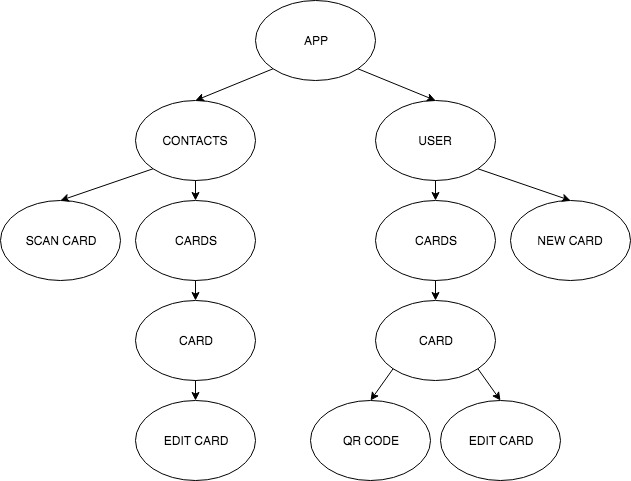

# PROJECT PLANNING
## Overview
The general idea is that users can use this app as a means of uploading, storing, and viewing their comic books. Simple, right? Seemingly. Though the MVP seems pretty to the point and achievable, the more complex things lay in the stretch goals in trying to provide users with new and interesting ways to read and interact with their comic books.

## Component Tree

### Component Breakdown
* **App:** Single common parent/ancestor for the entire application. Will hold state or Redux store and handle routing.
* **Public:** Contains all public-facing comics and data for viewing and use without user login or specific user privileges.
* **User:** Contains all user-oriented comics and data for viewing only by specified user.
* **Comic List:** Contains all data/comics for reading
* **Comic Preview:** A card previewing the comic's cover and relevant information (name, issue, etc.)
* **Comic:** The rendered images/pages of the comic for viewing.
